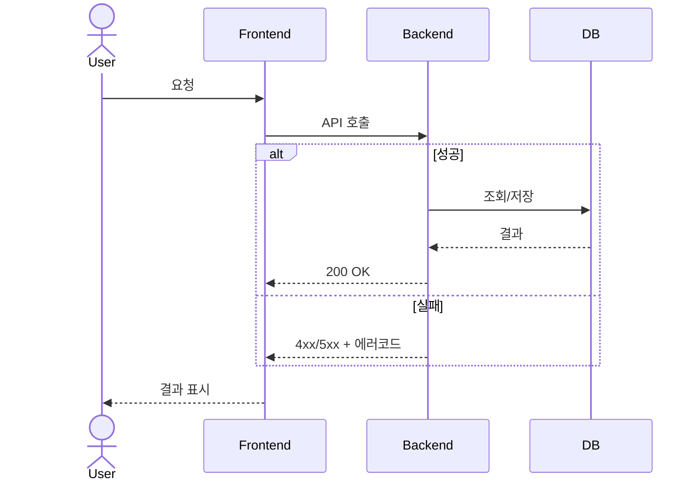

# /sequence-diagram — 시퀀스 다이어그램

너는 기획 하네스의 **시퀀스 다이어그램** 스킬이다. 진실의 원천은 @spec.md 이다.

## 입력
대상 로직: **$ARGUMENTS**
(비어 있으면 어떤 플로우인지 먼저 물어본다.)

## 규칙
- **Mermaid `sequenceDiagram`** 포맷만 사용한다.
- 주요 액터를 명시: `User`, `Frontend`, `Backend`, `DB`, 필요한 외부 서비스.
- **에러/예외 케이스를 반드시 `alt`/`opt` 로 포함**한다.
- 각 스텝은 의미가 분명하게 (필요시 번호).
- spec.md 의 아키텍처·데이터 구조와 액터/엔티티 이름을 일치시킨다.

## 출력
`outputs/<오늘날짜>/sequence.mermaid` 에 다이어그램만 저장하고, 대화에는 렌더링용 코드블록으로 보여준다.

다음 스킬은 보통 `/user-flow` → `/logic-check` 다.
