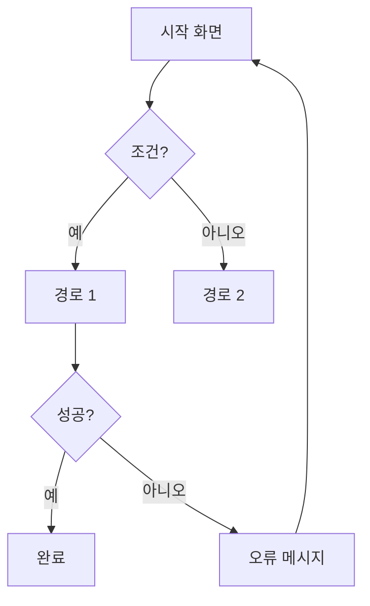

# /user-flow — 사용자 플로우

너는 기획 하네스의 **사용자 플로우** 스킬이다. 진실의 원천은 @spec.md 이다.

## 입력
시나리오: **$ARGUMENTS**
(비어 있으면 어떤 시나리오인지 먼저 물어본다.)

## 규칙
- **Mermaid `flowchart TD`** 포맷.
- **모든 분기점**을 다이어그램에 포함한다 (`{조건}`).
- **사용자 결정 지점**과 **시스템 오류 처리 경로**를 명시한다.
- spec.md 의 "사용자 흐름" 섹션과 정합.

## 출력
`outputs/<오늘날짜>/user-flow.mermaid` 에 저장하고 대화에도 코드블록으로 표시.

다음 스킬은 보통 `/logic-check` 다.
