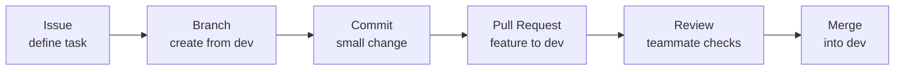

# GitHub Collaboration Practice - Issue #1

This document records a first GitHub collaboration practice flow for the `kiba-sync` project.

## Practice Owner

- Issue: #1
- Assignee: @feed-mina
- Working branch: `feature/1-git-pr-practice`
- Pull request target: `dev`

## Practice Flow

## What We Practiced

- Create an issue before starting work.
- Assign the issue owner.
- Create a feature branch from `dev`.
- Make a small documentation change.
- Open a pull request from the feature branch into `dev`.

## Team Rule Reminder

- `main` keeps stable code.
- `dev` collects reviewed work before release.
- `feature/*` branches are used for one issue or one small task.
